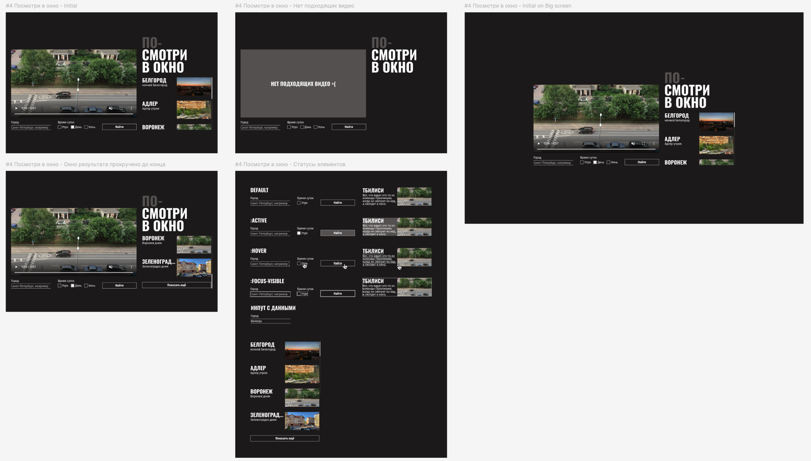

# Яндекс.Практикум — Спринт 2: Проектная работа «Посмотри в окно»

## Содержание

- [Обзор](#обзор)
  - [Задача](#задача)
  - [Скриншот](#скриншот)
  - [Ссылки](#ссылки)
- [Процесс работы](#процесс-работы)
  - [Стек технологий](#стек-технологий)
  - [Чему я научился](#чему-я-научился)

## Обзор

### Задача

В этой проектной работе вам предстоит написать CSS для уже работающего приложения «Посмотри в окно». Вы дополните файл style.css так, чтобы интерфейс соответствовал макету проекта.

### Скриншот

### Ссылки

- URL живого сайта: [Ссылка на живой сайт](https://vimanshin.github.io/)

## Процесс работы

### Стек технологий

### Чему я научился
